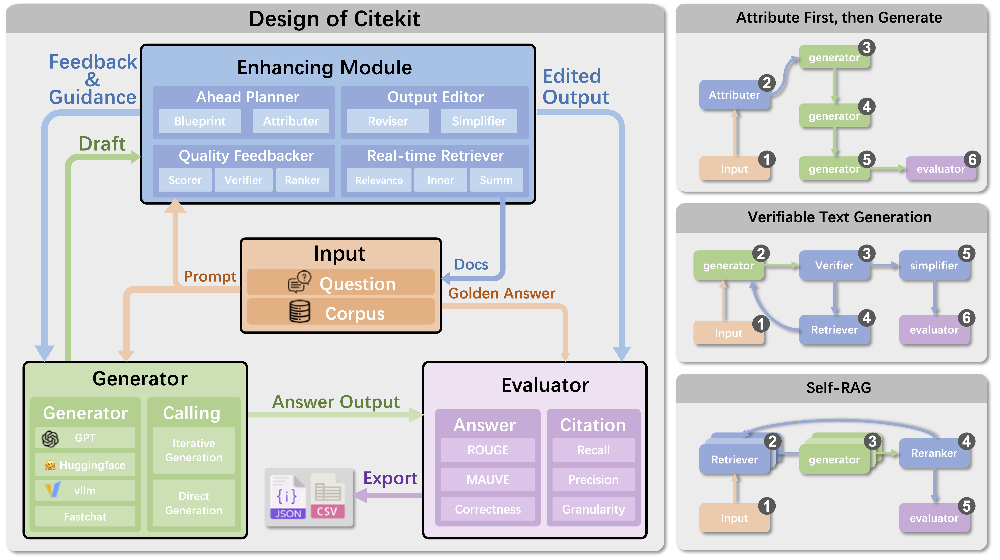

# Citekit

<div align="center">
<a href="///" target="_blank"></a><a href="https://github.com/SjJ1017/Citekit/blob/main/LICENSE"></a>
<a href="https://arxiv.org/abs/2408.04662" target="_blank"></a>
</div>

## Overview

**Citekit** is an open-source, extensible toolkit designed to facilitate the implementation and evaluation of citation generation methods for Large Language Models (LLMs). It offers a modular framework to standardize citation tasks, enabling reproducible and comparable research while fostering the development of new approaches to improve citation quality.



## Features

+ **Modular Design**: Citekit is composed of four main modules: **INPUT**, **GENERATION MODULE**, **ENHANCING MODULE**, and **EVALUATOR**. These modules can be combined to construct pipelines for various citation generation tasks.
+ **Extensibility**: Easily extend Citekit by adding new components or modifying existing ones. The toolkit supports different LLM frameworks, including Hugging Face and API-based models like OpenAI.
+ **Comprehensive Evaluation**: Citekit includes predefined metrics for evaluating both answer quality and citation quality, with support for custom metrics.
+ **Predefined Recipes**: The toolkit provides 11 baseline recipes derived from state-of-the-art research, allowing users to quickly implement and compare different citation generation methods.

## Installation

To install Citekit, clone the repository from GitHub:

```bash
git clone https://github.com/SjJ1017/Citekit.git
cd Citekit
pip install -r requirements.txt
```

## Usage

### Run a Citation Generation Pipeline

To realize an existing pipeline, for example:

```bash
export PYTHONPATH="$PWD"
python methods/ALCE_Vani_Summ_VTG.py --mode text --pr --rouge --qa
```

Some files contain multiple methods. Use --mode to specify the desired method. For any pre-defined metrics, use --metric to enable it. Available metrics include:
- `rouge`, `mauve` and `length`
- `qa`(for ASQA only), `qampari`(for QAMPARI only), and `claims`(for ELI5 only)
- `pr`: citation precision and recall

Other optional flags:
- `model`: openai model or model path in huggingface. By default the model is `gpt-3,5-turbo`, and please set `export OPENAI_API_KEY=your_token`
- `save_path`: the output path of the result
- `dataset` and `demo`: dataset file and the demonstration file for prompts, by default ASQA.
- `ndoc`: number of documents. Not applicable for some methods that donot use fixed number of documents.
- `shots`: number of few shots

### Constructing a Citation Generation Pipeline
To construct a pipeline, follow the steps in the demonstration.ipynb file or our video on [Youtube](https://youtu.be/KaNICbbmCn0), a simple example is presented below:

```python
dataset = FileDataset('data/asqa.json')

with open('prompts/asqa.json','r',encoding='utf-8') as file:
        demo = json.load(file)
        instruction =  demo['INST']

prompt = Prompt(template='<INST><question><docs><prefix><span>Answer: ',
                components={'INST':'{INST}\n\n', 
                            'question':'Question:{question}\n\n',
                            'docs':'{docs}\n',
                            'span':'The highlighted spans are: \n{span}\n\n',
                            'prefix':'Prefix: {prefix}\n\n',
                            })

evaluator = DefaultEvaluator(criteria = ['str_em','length','rouge'])
attributer = AttributingModule(model='gpt-3.5-turbo')
llm = LLM(model='gpt-3.5-turbo',prompt_maker=prompt, self_prompt={'INST':instruction})
pipeline = Sequence(sequence = [llm], head_prompt_maker = prompt, evaluator = evaluator, dataset = dataset)
pipeline.run_on_dataset(datakeys=['question','docs'], init_docs='docs')
```

## Contributing

We welcome contributions to improve Citekit. Please submit pull requests or open issues on the [GitHub repository](https://github.com/SjJ1017/Citekit).

## License

This project is licensed under the MIT License - see the LICENSE file for details.


------
